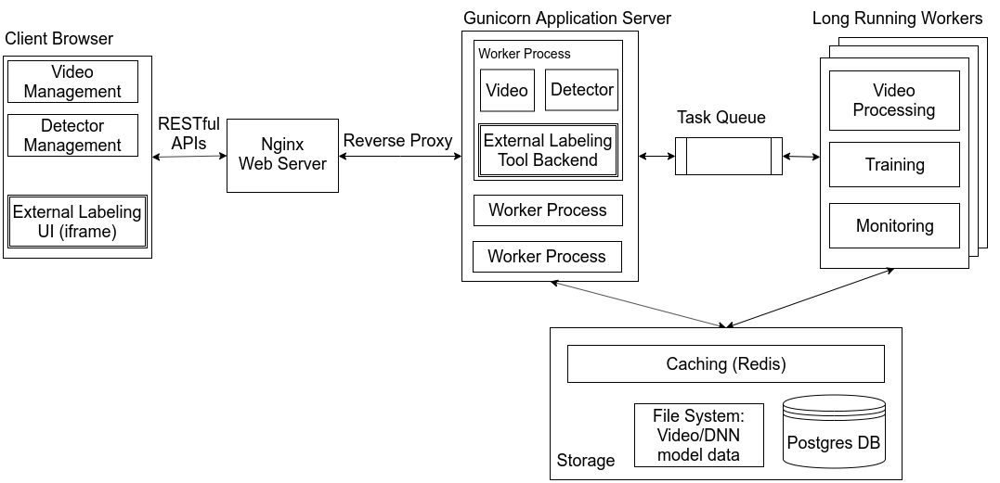

# Guide to Setup the Server

## Background

### OpenTPOD Architecture



### What is in this repository

* config: Django website configuration files.
* requirements: Conda and pip requirement files for development and deployment.
* opentpod: Main Django module for OpenTPOD.
* cvat: a symlink to third_party/cvat. Integrated third party annotation tool CVAT. This symlink is needed here for it to be treated as a Django module as well.
* keys: a keys directory with an empty module to make CVAT behave nicely.
* supervisord: supervisord configurations to launch the server.
* nginx: nginx configuration files.
* docker-compose.debug.yml: debug Docker compose file.
* docker-compose.prod.yml: Docker compose file for deployment.
* Dockerfile: Dockerfile to build the openTPOD container image.
* .envrc.example: Example environment variables to set.
* manage.py: Django manage.py file to run Django default functionalities.
* third_party: git submodules referencing CVAT releases.
* frontend: React-based frontend. Created using the create-react-app.
* build_frontend.sh: Script to build frontend React code and collect Django
  static files together into static and www directory for serving.
* docs: documentation

## Installation

First, clone this repository with submodules.

```bash
git clone --recurse-submodules -j8 https://github.com/cmusatyalab/OpenTPOD.git
```

Then, configure the environmental variables, mostly setting passwords by copying
and editing .envrc.example file.

```
$ cp .envrc.example .envrc.prod
$ vi .envrc.prod
```

The server can be started in either **deployment** or **debug** configurations.

### Deployment

This configurations runs everything inside containers.

```bash
$ # make sure you have copied and modified .envrc.example to .envrc.prod
$ source .envrc.prod
$ docker-compose -f docker-compose.prod.yml build
$ docker-compose -f docker-compose.prod.yml up
```

The server may take a few mintues to start up, as it builds its React frontend. After the server is up, indicated by log message "listening at..", create an administrative account with the following command.

```bash
docker-compose -f docker-compose.prod.yml exec opentpod bash -lc '/opt/conda/envs/opentpod-env/bin/python manage.py createsuperuser'
```

Now, you can access the website with the admin account at **http://host-or-ip-name:20000/**.

### Debugging Backend inside Containers (Recommended)

This would create infrastructures inside containers while running the django
development server natively on the host.

```bash
$ # make sure you have copied and modified .envrc.example to .envrc.prod
$ source .envrc.prod
$ docker-compose -f docker-compose.debug.yml build
$ docker-compose -f docker-compose.debug.yml up
$ # access opentpod container
$ docker-compose -f docker-compose.debug.yml exec opentpod /bin/bash
$ # inside opentpod container
$ conda activate opentpod-env
$ # modify the code as you see fit
$ # to launch the server and testing
$ ./build_frontend.sh
$ python manage.py migrate
$ python manage.py rqworker default low tensorboard
$ python manage.py runserver 0.0.0.0:8000
```

### Debugging Backend and Frontend without Containers 
```
$ # install all the dependencies, follow Dockerfile
$ # run backend server
$ python manage.py migrate
$ python manage.py createsuperuser
$ python manage.py collectstatic
$ python manage.py rqworker default low tensorboard
$ python manage.py runserver 0.0.0.0:8000
$
$ # launch npm dev server for serving frontend code
$ cd frontend
$ npm install
$ npm run-script watch
```

## Administration

#### Create User Accounts

Users can create accounts by following the *sign up* link on the login page. 
However, newly created accounts do not have access to the website functionalities 
until an administrator explicitly gives the account permission. 
See [below](#### Grant users permission to access the system) for granting users permissions to access the website.

#### Grant users permission to access the system

1. Go to /admin/auth/user and login with an administrator account.
2. Click on the user name you want to modify.
3. In "Permissions >> Groups", choose the appropriate permission group for the user. Normal users should be assigned "user" group while administrator accounts should be assigned "admin" group.
